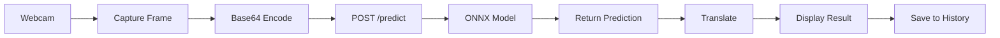

# 🎯 Sign Language Recognition - Complete Guide

Production-ready sign language phrase recognition system using EfficientNetB3 with MediaPipe hand detection and FastAPI backend.

---

## 📋 Table of Contents
- [Quick Start](#-quick-start)
- [Complete Setup Guide](#-complete-setup-guide-from-scratch)
- [Quick Reference](#-quick-reference-card)
- [Project Structure](#-project-structure)
- [Project Architecture](#-project-architecture-restructure)
- [Frontend Application](#-frontend-application)
- [Model Training](#-model-training)
- [FastAPI Backend](#-fastapi-backend)
- [Testing](#-testing)
- [End-to-End Pipeline Testing](#-end-to-end-pipeline-testing)
- [Deployment](#-deployment)
- [Technical Specifications](#-technical-specifications)
- [Troubleshooting](#-troubleshooting)

---

## 🚀 Quick Start

### ⚡ One-Line Quick Start (Windows)
```batch
run.bat
```
Then follow the numbered menu!

### 📦 Manual Quick Start

#### 1. Install Dependencies
```bash
# Backend dependencies
pip install -r requirements.txt

# Frontend dependencies
cd frontend
npm install
cd ..
```

#### 2. Train the Model
```bash
python ML/train_v2.py
```
**Expected time:** 30-60 minutes (GPU) or 2-4 hours (CPU)

**Output files:**
- `backend/model_v2.onnx` - Production ONNX model
- `backend/class_labels.txt` - 43 sign language classes
- `backend/temp_scale.json` - Temperature scaling calibration
- `best_model.h5` - Keras checkpoint
- `confusion_matrix.png` - Validation confusion matrix

#### 3. Test the Model
```bash
# Test on specific image
python ML/inference.py ./data/stop/1.png

# Test on random samples
python ML/inference.py
```

#### 4. Start Both Servers

**Terminal 1 - Backend:**
```bash
python backend/main.py
```
**API available at:** http://localhost:8000  
**API Docs:** http://localhost:8000/docs

**Terminal 2 - Frontend:**
```bash
cd frontend
npm run dev
```
**Web UI available at:** http://localhost:3000

#### 5. Run End-to-End Tests
```bash
python test_pipeline.py
# Or via run.bat → Option 15
```

---

## 🚀 Complete Setup Guide (From Scratch)

This comprehensive guide takes you from zero to a fully running Sign Language Recognition system.

### 📋 Prerequisites

#### Required Software:
- **Python 3.8+** ([Download](https://www.python.org/downloads/))
- **Git** ([Download](https://git-scm.com/downloads))
- **Node.js 14+** with npm ([Download](https://nodejs.org/))

#### Hardware Recommendations:
- **RAM**: 8GB minimum, 16GB recommended
- **GPU**: NVIDIA GPU with CUDA support (optional, for faster training)
- **Storage**: 5GB free space
- **Webcam**: For real-time detection (optional)

#### Check Prerequisites:
```bash
python --version    # Should show 3.8 or higher
node --version      # Should show 14 or higher
npm --version       # Should be installed with Node
git --version       # Any recent version
```

### 📥 Step 1: Clone/Download the Project

#### Option A: Already Have the Project
If you're already in the project directory, skip to Step 2.

#### Option B: From Git Repository
```bash
git clone <repository-url>
cd SLI
```

#### Option C: From ZIP
1. Extract the ZIP file
2. Open terminal in the extracted folder

### 🔧 Step 2: Install Backend Dependencies

#### Windows (using run.bat):
```batch
run.bat
→ Choose option 1: "Install dependencies (backend)"
```

#### Manual Installation:
```bash
# Create virtual environment (recommended)
python -m venv venv

# Activate virtual environment
# Windows:
venv\Scripts\activate
# Linux/Mac:
source venv/bin/activate

# Install dependencies
pip install -r requirements.txt
```

#### What Gets Installed:
```
✓ TensorFlow (deep learning framework)
✓ FastAPI & Uvicorn (backend API)
✓ ONNX Runtime (optimized inference)
✓ MediaPipe (hand detection)
✓ NumPy, Pillow, scikit-learn (utilities)
✓ Matplotlib (visualization)
```

**⏱️ Time:** ~5-15 minutes (depending on internet speed)

### 🎨 Step 3: Install Frontend Dependencies

#### Using run.bat:
```batch
run.bat
→ Choose option 2: "Install frontend dependencies"
```

#### Manual Installation:
```bash
cd frontend
npm install
cd ..
```

**⏱️ Time:** ~3-10 minutes

### 📊 Step 4: Prepare Dataset

The project expects data in this structure:
```
data/
├── stop/
│   ├── 1.png
│   ├── 2.png
│   └── ...
├── hello/
│   ├── 1.png
│   └── ...
├── thank you/
└── ... (43 total sign classes)
```

#### Option A: Use Existing Dataset
If you already have `data/` folder with images, you're good to go!

#### Option B: Download Sample Dataset
Place your dataset in the `data/` folder with subdirectories for each class.

#### Option C: Skip for Now
You can test with a pre-trained model (if provided) or train on minimal data.

### 🤖 Step 5: Train the Model

This is the core step that creates your AI model.

#### Using run.bat (Recommended):
```batch
run.bat
→ Choose option 4: "Train model"
→ Confirm (y)
```

#### Manual Training:
```bash
python ML/train_v2.py
```

#### What Happens:
1. ✅ Loads dataset from `data/` folder
2. ✅ Builds EfficientNetB3 model (300×300 input)
3. ✅ Applies data augmentation (rotation, zoom, etc.)
4. ✅ Trains with mixed precision (faster on GPU)
5. ✅ Performs temperature scaling calibration
6. ✅ Exports model files

#### Output Files:
```
✓ best_model.h5              (Keras checkpoint)
✓ backend/model_v2.onnx      (ONNX model for deployment)
✓ backend/class_labels.txt   (43 sign classes)
✓ backend/temp_scale.json    (confidence calibration)
✓ confusion_matrix.png       (evaluation plot)
✓ logs/fit/effnet_b3_*/      (TensorBoard logs)
```

#### Training Time:
- **With GPU**: 30-60 minutes
- **CPU Only**: 2-4 hours
- **Dataset**: ~5,000 images × 43 classes

#### Monitor Training (Optional):
```bash
# In a separate terminal
tensorboard --logdir=logs/fit
# Open http://localhost:6006 in browser
```

### 🧪 Step 6: Test the Model

#### Quick Test:
```batch
run.bat
→ Choose option 5: "Test model (single image)"
→ Enter path: data/stop/1.png
```

#### Random Samples:
```batch
run.bat
→ Choose option 6: "Test model (random samples)"
```

#### Manual Testing:
```bash
python ML/inference.py data/stop/1.png
```

**Expected Output:**
```
Top 5 Predictions:
1. stop                    87.45% ███████████████████████████████
2. wait                    5.23%  ██
3. break                   2.11%  █
```

### 🌐 Step 7: Start the Backend Server

#### Using run.bat:
```batch
run.bat
→ Choose option 7: "Start FastAPI server"
```

#### Manual Start:
```bash
cd backend
python main.py
# Or using uvicorn directly:
# uvicorn main:app --host 0.0.0.0 --port 8000 --reload
```

#### Verify Backend is Running:
- Open browser: http://localhost:8000
- API Docs: http://localhost:8000/docs
- Health Check: http://localhost:8000/health

**✓ Backend is Ready!** Leave this terminal running.

### 🎨 Step 8: Start the Frontend

#### Development Mode (Hot Reload):

**Using run.bat:**
```batch
# Open a NEW terminal window
run.bat
→ Choose option 9: "Start React frontend (dev)"
```

**Manual Start:**
```bash
cd frontend
npm run dev
```

**Access:** http://localhost:3000

#### Production Build:
```batch
run.bat
→ Choose option 10: "Build frontend (production)"
```

**✓ Frontend is Ready!** Leave this terminal running too.

### 🎥 Step 9: Use the Application

#### Web Interface:
1. Open http://localhost:3000
2. Click "Start Detection"
3. Allow webcam access
4. Show hand signs to the camera
5. See real-time predictions!

#### API Usage (Python):
```python
import requests
import base64

# Read image
with open('data/stop/1.png', 'rb') as f:
    image_bytes = f.read()

# Encode to base64
b64_image = base64.b64encode(image_bytes).decode('utf-8')

# Make prediction request
response = requests.post(
    'http://localhost:8000/predict',
    json={'image': b64_image, 'top_k': 5}
)

result = response.json()
print(f"Prediction: {result['prediction']}")
print(f"Confidence: {result['confidence']:.2f}%")
```

#### cURL:
```bash
curl -X POST http://localhost:8000/predict \
  -H "Content-Type: application/json" \
  -d '{"image":"<base64-encoded-image>","top_k":5}'
```

### 🧪 Step 10: Run End-to-End Tests

Test the entire pipeline automatically:

```batch
run.bat
→ Choose option 15: "Run end-to-end pipeline test"
```

This will:
- ✅ Start backend
- ✅ Build and serve frontend
- ✅ Test all API endpoints
- ✅ Run model evaluation
- ✅ Generate test report
- ✅ Clean shutdown

**Output:** `pipeline_test_results.json`

### 🔄 Common Workflows

#### Daily Development Workflow:
```batch
1. run.bat → Option 7 (Start backend)
2. run.bat → Option 9 (Start frontend dev)
3. Make changes
4. Test in browser (auto-reload)
```

#### Retrain Model:
```batch
1. Update dataset in data/
2. run.bat → Option 4 (Train model)
3. Wait for training (~30-60 min)
4. Restart backend (Option 7)
```

#### Deploy to Production:
```batch
1. run.bat → Option 10 (Build frontend)
2. Copy frontend/dist/ to web server
3. Deploy backend with model_v2.onnx
4. Configure CORS and environment variables
```

#### Run Full Test Suite:
```batch
run.bat → Option 15 (Pipeline test)
```

### ✅ Success Checklist

- [ ] Python 3.8+ installed
- [ ] Node.js 14+ installed
- [ ] Backend dependencies installed (`pip install -r requirements.txt`)
- [ ] Frontend dependencies installed (`npm install`)
- [ ] Dataset in `data/` folder (43 classes)
- [ ] Model trained (`backend/model_v2.onnx` exists)
- [ ] Backend running (http://localhost:8000)
- [ ] Frontend running (http://localhost:3000)
- [ ] Predictions working (tested with webcam or image)
- [ ] Tests passing (`run.bat → Option 15`)

**Congratulations! Your Sign Language Recognition system is fully operational! 🎉**

---

## 📝 Quick Reference Card

### 🌐 URLs

| Service | URL | Purpose |
|---------|-----|---------|
| Frontend | http://localhost:3000 | Web interface |
| Backend API | http://localhost:8000 | REST API |
| API Docs | http://localhost:8000/docs | Interactive API docs |
| Health Check | http://localhost:8000/health | Server status |
| TensorBoard | http://localhost:6006 | Training metrics |

### 📁 Key Files

| File | Purpose |
|------|---------|
| `backend/model_v2.onnx` | Trained AI model (50MB) |
| `backend/class_labels.txt` | 43 sign language phrases |
| `backend/temp_scale.json` | Confidence calibration |
| `best_model.h5` | Keras checkpoint |
| `data/` | Training dataset |
| `run.bat` | Main launcher |

### 🔧 Quick Fixes

#### Port Already in Use:
```bash
# Windows
netstat -ano | findstr :8000
taskkill /PID <process-id> /F
```

#### Model Not Found:
```batch
run.bat → 4  (Train model)
```

#### Dependencies Error:
```bash
pip install -r requirements.txt --force-reinstall
```

#### Frontend Won't Build:
```bash
cd frontend
rmdir /s /q node_modules
npm install
```

### 🎯 run.bat Menu

```
1.  Install dependencies (backend)
2.  Install frontend dependencies
4.  Train model ⚠️ Takes 30-60 min
5.  Test model (single image)
6.  Test model (random samples)
7.  Start FastAPI server ⭐
8.  Test API endpoints
9.  Start React frontend (dev) ⭐
10. Build frontend (production)
11. View model info
12. Open API documentation
13. Preprocess dataset (MediaPipe)
14. Evaluate model (metrics)
15. Run end-to-end pipeline test 🧪
0.  Exit
```

**⭐ = Most used options**

### 📊 Training Metrics

| Metric | Target |
|--------|--------|
| Training Accuracy | 95-99% |
| Validation Accuracy | 85-95% |
| Inference Speed | 50-200ms |
| Model Size | ~50MB |

### ⏱️ Time Estimates

| Task | Time |
|------|------|
| Install backend deps | 5-15 min |
| Install frontend deps | 3-10 min |
| Train model (GPU) | 30-60 min |
| Train model (CPU) | 2-4 hours |
| Build frontend | 1-3 min |
| E2E pipeline test | 2-5 min |

### 📱 Testing Checklist

- [ ] Backend health: http://localhost:8000/health
- [ ] API docs: http://localhost:8000/docs
- [ ] Frontend loads: http://localhost:3000
- [ ] Single image test: `run.bat → 5`
- [ ] API test: `run.bat → 8`
- [ ] Full pipeline: `run.bat → 15`

---

## 🏗️ Project Architecture (Restructure)

### Overview
The project has been restructured to focus on the optimized **EfficientNetB3** pipeline with **MediaPipe** integration, removing legacy MobileNetV2 code for better maintainability and performance.

### Key Changes

#### 1. Training Pipeline
- **Primary**: `ML/train_v2.py` - New main training script
  - EfficientNetB3 architecture (300×300 input)
  - Mixed precision training (mixed_float16)
  - TensorFlow per-image standardization
  - Label smoothing (0.1)
  - Comprehensive augmentation (rotation, translation, zoom, contrast, brightness)
  - Early stopping, learning rate reduction, TensorBoard logging
  - Exports to both H5 (`best_model.h5`) and ONNX (`backend/model_v2.onnx`)
  - Built-in temperature scaling calibration → `backend/temp_scale.json`
  - Validation evaluation with confusion matrix plot

- **Deprecated**: Legacy MobileNetV2 scripts removed

#### 2. Backend Inference
- **New**: `backend/ensemble_inference.py` - Extracted model class
  - ONNXSignLanguageModel with optional MediaPipe cropping
  - Temperature scaling from JSON
  - Rolling average smoothing (window=5)
  - Optional landmark model ensemble (combines log-probabilities)
  - Confidence threshold ("Detecting..." below 0.6)
  
- **Updated**: `backend/main.py`
  - Imports ONNXSignLanguageModel from ensemble_inference
  - Simplified FastAPI endpoints (health, predict, classes, model-info)
  - Default model path: `backend/model_v2.onnx`

- **Updated**: `backend/onnx_utils.py`
  - Default model path → `model_v2.onnx`
  - Preprocessing aligned with TF per-image standardization

#### 3. Preprocessing & Evaluation
- **MediaPipe**: `ML/preprocess_hands.py` - Hand cropping and landmark extraction
- **Evaluation**: `ML/evaluate_model.py` - Comprehensive metrics and plots
- **Calibration**: `ML/calibration.py` - Standalone temperature scaling utility

#### 4. Inference Utilities
- **Updated**: `ML/inference.py`
  - Default model path → `model_v2.onnx`
  - TF per-image standardization preprocessing
  - Error messages reference `train_v2.py`

#### 5. Launcher Script
- **Updated**: `run.bat`
  - Option 4: Trains using `ML/train_v2.py`
  - Option 11: Model info uses `backend\model_v2.onnx`
  - Option 7: Server checks for `model_v2.onnx`
  - Option 15: End-to-end pipeline test

### Model Artifacts

#### Primary Artifacts (v2 Pipeline)
```
backend/
├── model_v2.onnx           ← Main ONNX model (EfficientNetB3)
├── class_labels.txt         ← Class names (43 phrases)
├── temp_scale.json          ← Temperature scaling config (T ~= 1.0–2.0)
└── landmark_model.onnx      ← Optional landmark model (if trained)

best_model.h5                ← Keras checkpoint
confusion_matrix.png         ← Validation confusion matrix plot
logs/fit/effnet_b3_*/        ← TensorBoard logs
```

### File Structure (Minimal ML Folder)

```
ML/
├── train_v2.py              ← Primary training pipeline (EfficientNetB3)
├── preprocess_hands.py      ← MediaPipe hand cropping & landmarks
├── calibration.py           ← Temperature scaling utility
├── evaluate_model.py        ← Model evaluation (metrics, plots)
└── inference.py             ← Quick inference tester
```

### Workflow

#### 1. Training from Scratch
```batch
run.bat → Option 4 (Train model)
  → Runs ML/train_v2.py
  → Outputs:
     - best_model.h5
     - backend/model_v2.onnx
     - backend/class_labels.txt
     - backend/temp_scale.json
     - confusion_matrix.png
```

#### 2. Preprocessing (Optional)
```batch
run.bat → Option 13 (Preprocess dataset)
  → Runs ML/preprocess_hands.py
  → Crops images to hand regions
  → Saves landmark CSVs
```

#### 3. Evaluation
```batch
run.bat → Option 14 (Evaluate model)
  → Runs ML/evaluate_model.py
  → Metrics: accuracy, top-3, F1, precision, recall
  → Plots: confusion matrix, per-class ROC
  → Output: evaluation_report.txt
```

#### 4. Serving
```batch
run.bat → Option 7 (Start FastAPI server)
  → Runs backend/main.py
  → Loads backend/model_v2.onnx
  → Ensemble: optional landmark_model.onnx
  → Temperature scaling from temp_scale.json
  → Rolling average smoothing
  → Endpoints: /health, /predict, /classes, /model-info
```

### Technical Details

#### Preprocessing Pipeline
1. **Resize** to model input size (300×300 or 224×224)
2. **Optional MediaPipe crop** (if enabled)
3. **TF per-image standardization**: `(x - mean(x)) / max(std(x), 1/sqrt(N))`
4. **Batch dimension**: (H, W, 3) → (1, H, W, 3)

#### Inference Pipeline
1. Load image → preprocess
2. **Image model** ONNX inference → probs₁
3. **Optional landmark model** (if present):
   - Extract 21×3 hand landmarks via MediaPipe
   - ONNX inference → probs₂
   - **Combine**: average log-probabilities → combined logits
4. **Temperature scaling**: logits / T → softmax
5. **Rolling average smoothing** (N=5)
6. **Threshold**: if max_confidence < 0.6 → "Detecting..."

#### Temperature Scaling
- Optimized on validation set via SciPy minimize_scalar
- Objective: minimize negative log-likelihood (NLL)
- Bounds: T ∈ [0.1, 5.0]
- Saved to `backend/temp_scale.json`
- Loaded at runtime by backend

### Advanced Configuration

#### Adjust Training Parameters:
Edit `ML/train_v2.py`:
```python
class EFFConfig:
    IMG_HEIGHT = 300        # Input size
    IMG_WIDTH = 300
    BATCH_SIZE = 32         # Batch size
    EPOCHS = 50             # Initial training epochs
    FINE_TUNE_EPOCHS = 30   # Fine-tuning epochs
    LEARNING_RATE = 1e-4    # Learning rate
```

#### Enable MixUp/CutMix Augmentation:
```python
USE_MIXUP = True           # Enable MixUp
USE_CUTMIX = True          # Enable CutMix
MIX_PROB = 0.7             # Probability
```

#### Enable MediaPipe Hand Cropping:
Set environment variable before starting backend:
```bash
# Windows
set ENABLE_MEDIAPIPE_CROP=1
python backend/main.py

# Linux/Mac
export ENABLE_MEDIAPIPE_CROP=1
python backend/main.py
```

### Performance Benchmarks

#### Expected Metrics:
- **Training Accuracy**: 95-99%
- **Validation Accuracy**: 85-95%
- **Inference Latency**: 50-200ms per image
- **Model Size**: ~50MB (ONNX)
- **Classes Supported**: 43 sign language phrases

#### Optimization Tips:
1. **Use GPU** for training (10-20× faster)
2. **Enable mixed precision** (already enabled in train_v2.py)
3. **Optimize batch size** based on GPU memory
4. **Use temperature scaling** (already included)
5. **Apply MediaPipe cropping** for better focus
6. **Ensemble models** (optional landmark model)

---

## 📁 Project Structure

```
SLI/
├── 📁 backend/
│   ├── 📄 main.py                 # FastAPI application
│   ├── 📄 ensemble_inference.py   # Model inference class
│   ├── 📄 onnx_utils.py           # ONNX wrapper utilities
│   ├── 📄 test_api.py             # API endpoint tests
│   ├── 🤖 model_v2.onnx           # Trained model ✓ (created by training)
│   ├── 📄 class_labels.txt        # Class names ✓ (created by training)
│   └── 📄 temp_scale.json         # Temperature calibration ✓ (created by training)
│
├── � frontend/
│   ├── 📁 src/
│   │   ├── 📁 components/         # React components
│   │   ├── 📁 services/           # API & translation services
│   │   ├── 📄 App.jsx             # Main application
│   │   └── 📄 index.css           # Tailwind CSS
│   ├── 📁 dist/                   # Production build ✓ (created by npm build)
│   ├── � package.json
│   ├── � vite.config.js          # Vite configuration
│   └── 📄 tailwind.config.js      # Tailwind customization
│
├── 📁 ML/
│   ├── 📄 train_v2.py             # Primary training script (EfficientNetB3)
│   ├── 📄 preprocess_hands.py     # MediaPipe hand cropping
│   ├── 📄 calibration.py          # Temperature scaling utility
│   ├── 📄 evaluate_model.py       # Model evaluation with metrics
│   └── 📄 inference.py            # Quick testing tool
│
├── 📁 data/                       # Training images (43 classes)
│   ├── 📁 stop/
│   ├── 📁 happy birthday/
│   ├── 📁 wait/
│   └── ... (43 classes total, ~40 images each)
│
├── 📄 requirements.txt            # Python dependencies
├── 📄 run.bat                     # Interactive launcher (Windows)
├── 📄 test_pipeline.py            # End-to-end pipeline orchestrator
├── 📄 best_model.h5               # Keras checkpoint ✓ (created by training)
├── 📄 confusion_matrix.png        # Evaluation plot ✓ (created by training)
├── 📁 logs/fit/                   # TensorBoard training logs ✓
└── 📄 README.md                   # This file
```

**✓ = Created after training or building**

---

## 🎨 Frontend Application

### Overview

Modern React application with:
- ✅ **Real-time Webcam Detection** - Automatic frame capture every 2 seconds
- ✅ **Confidence Threshold Control** - Slider to ignore low-confidence predictions
- ✅ **Multi-language Translation** - Hindi, Marathi, Spanish, French, German, Japanese, Chinese, Arabic
- ✅ **Beautiful UI** - TailwindCSS + Framer Motion animations
- ✅ **Correct Camera Orientation** - Mirroring disabled to match training data
- ✅ **Reversed L-Shape Layout** - Left vertical navbar + top horizontal header
- ✅ **Detection History Table** - Track all detections with timestamps
- ✅ **Live Backend Monitoring** - Real-time connection status

### Quick Start

```bash
# Navigate to frontend
cd frontend

# Install dependencies
npm install

# Start development server
npm run dev
```

Frontend will be available at: **http://localhost:3000**

### Features

#### 1. Webcam Capture
- Live webcam feed with frame markers
- Automatic detection every 2 seconds
- Manual capture button
- Recording indicators

#### 2. Detection Display
- Large detected phrase with animations
- Confidence progress bar
- Top 3 alternative predictions
- Detection statistics

#### 3. Language Translation
- Dropdown with 9 languages
- Quick language selection pills
- Automatic translation using LibreTranslate
- Translation loading indicators

#### 4. History Table
- All detections with timestamps
- Confidence scores as progress bars
- Translations for each detection
- Clear history button
- Statistics: total detections, average confidence, unique signs

#### 5. Navigation Tabs
- 🏠 Home - Welcome page with features
- 📹 Detect - Main detection interface
- 📊 History - Detection history table
- 📚 Learn - Learning resources (coming soon)
- ⚙️ Settings - App settings and backend status
- ℹ️ About - Project information

### Technology Stack

- **React** 18.3.1 - UI library
- **Vite** 5.4.11 - Build tool & dev server
- **TailwindCSS** 3.4.0 - Utility-first CSS
- **Framer Motion** 11.0.3 - Smooth animations
- **React-Webcam** 7.2.0 - Webcam access
- **Axios** 1.6.2 - HTTP client for API calls
- **LibreTranslate** - Free translation API

### API Integration

Frontend uses Vite proxy to connect to backend:

```javascript
// Frontend makes requests to /api/*
// Vite proxies to http://localhost:8000/*

axios.post('/api/predict', { image: base64Image })
axios.get('/api/health')
```

### Building for Production

```bash
# Build optimized production bundle
npm run build

# Preview production build
npm run preview
```

Output will be in `frontend/dist/` directory.

---

## 🎓 Model Training

### What You'll Get

After training completes, you'll have:
1. **`backend/model.onnx`** or `backend/model_v2.onnx` (EfficientNet) - Production-ready ONNX model
2. **`backend/class_labels.txt`** - List of all 44 sign phrases
3. **`training_history.png`** - Training/validation accuracy & loss plots
4. **`best_model.h5`** - Keras checkpoint (backup)

### Training Process

The default script (ML/train.py) uses a modern tf.data pipeline with balanced sampling, per-image standardization, and a **two-stage training approach**:

#### Stage 1: Initial Training (Frozen Base)
- MobileNetV2 base layers are frozen
- Only custom top layers are trained
- Fast convergence to good baseline

#### Stage 2: Fine-Tuning
- Last 30 layers of MobileNetV2 are unfrozen
- Lower learning rate (10× reduction)
- Refines features for sign language domain

### Configuration

Edit `train.py` to customize:

```python
class Config:
    IMG_HEIGHT = 224          # Image height
    IMG_WIDTH = 224           # Image width
    BATCH_SIZE = 32           # Batch size (reduce if OOM)
    EPOCHS = 50               # Max epochs
    VALIDATION_SPLIT = 0.2    # 20% for validation
    LEARNING_RATE = 0.0001    # Initial learning rate
    PATIENCE = 10             # Early stopping patience
```

### Dataset Verification

Before training, verify your dataset:

```bash
python verify_dataset.py
```

**This checks:**
- ✅ Image count per class
- ✅ Dataset balance
- ✅ Corrupted images
- ✅ Image size consistency
- ✅ Recommendations

### Expected Performance

- **Validation Accuracy**: 85-95%
- **Top-3 Accuracy**: 95-99%
- **Training Time**: 
  - GPU: 30-60 minutes
  - CPU: 2-4 hours

### Model Architecture

```
Input (224×224×3)
    ↓
MobileNetV2 (pre-trained on ImageNet)
    ↓
GlobalAveragePooling2D
    ↓
Dense(512) + BatchNorm + Dropout(0.5)
    ↓
Dense(256) + BatchNorm + Dropout(0.3)
    ↓
Dense(44, softmax)
    ↓
Predictions
```

**Total Parameters:** ~3M
- MobileNetV2: ~2.2M
- Custom layers: ~800K

### Data Pipeline and Augmentation

ML/train.py now uses tf.data with:
- Per-image standardization (zero mean, unit variance)
- Class balancing (oversampling minority classes)
- Class weights for imbalanced data
- Augmentations: RandomRotation, RandomTranslation, RandomZoom, RandomContrast, RandomBrightness
- Prefetching for performance

Advanced option ML/train_efficientnet_b3.py adds:
- EfficientNetB3 backbone with label smoothing
- Optional MixUp and CutMix (batch-wise)
- Fine-tuning with layer unfreezing
- Exports ONNX as `backend/model_v2.onnx`

---

## 🚀 FastAPI Backend

### Quick Start

```bash
# Install dependencies (if not already installed)
pip install -r requirements.txt

# Start the server
python backend/main.py
```

Server will be available at:
- **API**: http://localhost:8000
- **Interactive Docs**: http://localhost:8000/docs
- **ReDoc**: http://localhost:8000/redoc

### API Endpoints

#### 1. Health Check - `GET /health`

Check if the API is ready and model is loaded.

**Response:**
```json
{
  "status": "healthy",
  "model_loaded": true,
  "model_path": "./backend/model.onnx",
  "num_classes": 44,
  "input_shape": [1, 224, 224, 3]
}
```

#### 2. Predict Sign Language - `POST /predict` ⭐

Predict sign language phrase from base64-encoded image.

**Request:**
```json
{
  "image": "base64_encoded_image_or_data_url",
  "top_k": 5
}
```

**Response:**
```json
{
  "success": true,
  "prediction": "happy birthday",
  "confidence": 94.23,
  "predictions": [
    {
      "rank": 1,
      "class": "happy birthday",
      "confidence": 0.9423,
      "confidence_percent": 94.23
    },
    {
      "rank": 2,
      "class": "congratulations",
      "confidence": 0.0312,
      "confidence_percent": 3.12
    }
  ],
  "processing_time_ms": 45.67
}
```

#### 3. Get All Classes - `GET /classes`

Returns all 44 available sign language classes.

#### 4. Get Model Info - `GET /model-info`

Returns detailed model configuration.

#### 5. Root - `GET /`

Returns API information and available endpoints.

### React Frontend Integration

```javascript
// Convert image to base64 and predict
const handleImageUpload = async (imageFile) => {
  // Convert to base64
  const reader = new FileReader();
  reader.readAsDataURL(imageFile);
  
  reader.onload = async () => {
    const base64Image = reader.result;
    
    // Send to API
    const response = await fetch('http://localhost:8000/predict', {
      method: 'POST',
      headers: { 'Content-Type': 'application/json' },
      body: JSON.stringify({
        image: base64Image,
        top_k: 5
      })
    });
    
    const data = await response.json();
    
    // Display results
    console.log('Prediction:', data.prediction);
    console.log('Confidence:', data.confidence + '%');
    console.log('Processing Time:', data.processing_time_ms + 'ms');
  };
};
```

### Python Client Example

```python
import base64
import requests

# Read and encode image
with open('test_image.png', 'rb') as f:
    image_data = base64.b64encode(f.read()).decode('utf-8')

# Send request
response = requests.post(
    'http://localhost:8000/predict',
    json={'image': image_data, 'top_k': 5}
)

result = response.json()
print(f"Prediction: {result['prediction']}")
print(f"Confidence: {result['confidence']:.2f}%")
```

### CORS Configuration

**Development (Current):**
```python
# Allows all origins
allow_origins=["*"]
```

**Production (Update in `backend/main.py`):**
```python
# Restrict to your Vercel frontend
allow_origins=[
    "https://your-app.vercel.app",
    "https://www.your-domain.com"
]
```

### Backend Features

✅ **Singleton Pattern**: Model loaded once on startup
✅ **Auto Provider Selection**: GPU (CUDA) → CPU fallback
✅ **Input Validation**: Pydantic models with custom validators
✅ **Error Handling**: Comprehensive error messages & logging
✅ **Async Processing**: All endpoints are async
✅ **Base64 Support**: Handles data URLs and plain base64
✅ **Top-K Predictions**: Configurable (1-10)

---

## 🧪 Testing

### Model Testing

```bash
# Test on specific image
python inference.py ./data/stop/1.png

# Test on random samples from dataset
python inference.py
```

**Example Output:**
```
======================================================================
Analyzing: ./data/stop/1.png
======================================================================

Top 5 Predictions:
──────────────────────────────────────────────────────────────────────
1. stop                      95.23% ██████████████████████████████████
2. wait                       2.45% ██
3. understand                 1.12% █
4. problem                    0.67% 
5. careful                    0.53% 
──────────────────────────────────────────────────────────────────────

✓ Predicted Sign: STOP
  Confidence: 95.23%
======================================================================
```

### API Testing

#### Automated Tests
```bash
# Make sure server is running
python backend/main.py

# In another terminal
python backend/test_api.py
```

#### Manual Testing (PowerShell)

**Health Check:**
```powershell
Invoke-RestMethod -Uri "http://localhost:8000/health" -Method Get
```

**Prediction:**
```powershell
# Read and encode image
$imagePath = ".\data\stop\1.png"
$imageBytes = [System.IO.File]::ReadAllBytes($imagePath)
$base64Image = [System.Convert]::ToBase64String($imageBytes)

# Send prediction request
$body = @{
    image = $base64Image
    top_k = 5
} | ConvertTo-Json

Invoke-RestMethod -Uri "http://localhost:8000/predict" `
    -Method Post `
    -ContentType "application/json" `
    -Body $body
```

#### Interactive Testing

Open http://localhost:8000/docs for Swagger UI where you can:
- Test all endpoints interactively
- See request/response schemas
- Try predictions directly in browser

---

## 🧪 End-to-End Pipeline Testing

### Overview
`test_pipeline.py` is a comprehensive orchestrator that tests the entire Sign Language Recognition system end-to-end automatically.

### What It Does

#### 1. **Starts Services**
- Launches FastAPI backend on port 8000 using uvicorn
- Builds React frontend (production build)
- Serves frontend on port 3000 using npx serve

#### 2. **Waits for Ready State**
- Polls backend health endpoint until ready (max 60s)
- Checks frontend availability (max 20s)
- Uses asyncio for non-blocking checks

#### 3. **Runs Tests**

**Backend API Tests:**
- `GET /` - Root endpoint
- `GET /health` - Health check (checks model loaded)
- `GET /classes` - Get all sign language classes
- `POST /predict` - Prediction with dummy image

**Model Evaluation (Optional):**
- Runs `ML/evaluate_model.py` if model exists
- Limited to 5 samples per class for quick testing
- Reports accuracy metrics

#### 4. **Collects Metrics**
- Request latency (milliseconds)
- API response status
- Model accuracy
- Test pass/fail counts
- Total execution time

#### 5. **Generates Report**
- Prints color-coded summary to console
- Saves detailed JSON report: `pipeline_test_results.json`

#### 6. **Clean Shutdown**
- Gracefully stops backend (SIGTERM)
- Gracefully stops frontend (SIGTERM)
- Force kills if needed (after 5s timeout)

### Usage

#### Option 1: Via run.bat (Recommended)
```batch
run.bat
→ Choose option 15: "Run end-to-end pipeline test"
```

#### Option 2: Direct Execution
```bash
python test_pipeline.py
```

### Requirements

**Python Packages:**
```
requests
Pillow
```

**System Requirements:**
- Python 3.8+
- Node.js and npm (for frontend)
- Trained model at `backend/model_v2.onnx` (optional for partial tests)

### Console Output Example

```
================================================================================
        Sign Language Recognition - End-to-End Pipeline Test
================================================================================

ℹ Starting FastAPI backend...
✓ Backend process started (PID: 12345)

ℹ Building and starting React frontend...
✓ Frontend built successfully
✓ Frontend process started (PID: 12346)

================================================================================
                    Waiting for Services to Start
================================================================================

ℹ Checking backend health...
✓ Backend is ready (http://localhost:8000)

ℹ Checking frontend...
✓ Frontend is ready (http://localhost:3000)

================================================================================
                    Testing Backend API Endpoints
================================================================================

✓ GET / - 45ms
✓ GET /health - 52ms (model_loaded: True)
✓ GET /classes - 48ms (43 classes)
✓ POST /predict (dummy image) - 156ms (pred: stop, conf: 23.4%)

================================================================================
                           Running Model Evaluation
================================================================================

ℹ Running evaluation on 43 classes...
✓ Model evaluation completed
ℹ Accuracy: 87.50%

================================================================================
                              Test Summary
================================================================================

Backend API Tests:
  Total:  4
  Passed: 4
  Failed: 0
  Success Rate: 100.0%

Model Evaluation:
  Status: completed
  Accuracy: 87.50%

Overall:
  Duration: 127.3s
  Start: 16:45:23
  End: 16:47:30

Results saved to: pipeline_test_results.json

================================================================================
                            Shutting Down Services
================================================================================

ℹ Stopping backend...
✓ Backend stopped

ℹ Stopping frontend...
✓ Frontend stopped

================================================================================
                          ✓ ALL TESTS PASSED
================================================================================
```

### JSON Report Structure

**`pipeline_test_results.json`:**
```json
{
  "start_time": "2025-10-26T16:45:23.123456",
  "end_time": "2025-10-26T16:47:30.456789",
  "duration_seconds": 127.3,
  "backend": {
    "pid": 12345,
    "status": "started",
    "ready": true
  },
  "frontend": {
    "pid": 12346,
    "status": "started",
    "ready": true
  },
  "tests": {
    "backend": {
      "total": 4,
      "passed": 4,
      "failed": 0,
      "tests": [
        {
          "name": "GET /",
          "status": "pass",
          "latency_ms": 45.2
        },
        {
          "name": "GET /health",
          "status": "pass",
          "latency_ms": 52.1,
          "model_loaded": true
        },
        {
          "name": "GET /classes",
          "status": "pass",
          "latency_ms": 48.7,
          "num_classes": 43
        },
        {
          "name": "POST /predict (dummy image)",
          "status": "pass",
          "latency_ms": 156.3,
          "prediction": "stop",
          "confidence": 23.4
        }
      ]
    },
    "evaluation": {
      "status": "completed",
      "accuracy": 87.5
    }
  }
}
```

### Features

- ✅ **Comprehensive Testing** - Backend, frontend, model evaluation
- ✅ **Async/Await** - Non-blocking service checks
- ✅ **Cross-Platform** - Works on Windows and Linux/macOS
- ✅ **Robust Error Handling** - Graceful degradation
- ✅ **Clean Shutdown** - SIGTERM with force kill fallback
- ✅ **Color-Coded Output** - Green ✓, Red ✗, Yellow ⚠, Blue ℹ

### Customization

**Skip Frontend:**
The script automatically skips frontend if `node_modules` is not found.

**Quick Model Evaluation:**
Default is 5 samples per class. Edit `--max-samples` in the script.

**Add More Tests:**
Extend `test_backend_endpoints()` method in `test_pipeline.py`.

**Custom Ports:**
Change port numbers in:
- `start_backend()` - default 8000
- `start_frontend()` - default 3000

### Troubleshooting

**"Backend failed to start"**
- Ensure `backend/model_v2.onnx` exists
- Check `requirements.txt` is installed
- Verify no process is using port 8000

**"Frontend build failed"**
- Run `npm install` in `frontend/` directory
- Check Node.js version (14+)
- Ensure `frontend/package.json` exists

**"Services not reachable"**
- Increase timeout in `check_url_ready()`
- Check firewall settings
- Verify ports 8000 and 3000 are available

**"Evaluation timed out"**
- Reduce dataset size
- Increase timeout in `run_model_evaluation()`
- Use `--max-samples` flag

### CI/CD Integration

This script can be used in CI/CD pipelines:

```yaml
# GitHub Actions example
- name: Run Pipeline Tests
  run: python test_pipeline.py
  timeout-minutes: 10

- name: Upload Test Results
  uses: actions/upload-artifact@v3
  with:
    name: pipeline-test-results
    path: pipeline_test_results.json
```

### Duration

Typical execution time:
- Backend start: ~5-10s
- Frontend build: ~30-60s
- Frontend serve: ~5s
- API tests: ~1-2s
- Model evaluation: ~30-60s
- **Total: ~2-5 minutes**

---

## 🌐 Deployment

### Update CORS for Production

**File:** `backend/main.py` (around line 233)

```python
# Change this:
allow_origins=["*"]

# To this:
allow_origins=["https://your-app.vercel.app"]
```

### Deployment Options

#### 1. Render (Recommended - Free Tier)

1. Push code to GitHub
2. Go to https://render.com → New Web Service
3. Connect repository
4. **Root directory**: `backend`
5. **Build command**: `pip install -r ../requirements.txt`
6. **Start command**: `uvicorn main:app --host 0.0.0.0 --port $PORT`
7. Set environment variables:
   - `MODEL_PATH=./model.onnx`
   - `LABELS_PATH=./class_labels.txt`
   - `ALLOWED_ORIGINS=https://your-frontend.vercel.app`
8. Deploy!

#### 2. Railway

1. Push to GitHub
2. Go to https://railway.app → New Project
3. Deploy from GitHub
4. Set root directory to `backend`
5. Railway auto-detects Python and runs

#### 3. Docker

```dockerfile
FROM python:3.10-slim

WORKDIR /app

# Copy and install dependencies
COPY requirements.txt .
RUN pip install --no-cache-dir -r requirements.txt

# Copy backend files
COPY backend/ .

# Expose port
EXPOSE 8000

# Run server
CMD ["uvicorn", "main:app", "--host", "0.0.0.0", "--port", "8000"]
```

**Build and run:**
```bash
docker build -t sli-backend .
docker run -p 8000:8000 sli-backend
```

### Environment Variables (Production)

Set these in your deployment platform:
- `PORT`: 8000 (or platform default)
- `ALLOWED_ORIGINS`: Your frontend URL
- `MODEL_PATH`: `./model.onnx`
- `LABELS_PATH`: `./class_labels.txt`

---

## 🔧 Technical Specifications

### Model Details

- **Architecture**: MobileNetV2 + Custom Layers
- **Input**: 224×224×3 RGB images
- **Output**: 44 class probabilities
- **Parameters**: ~3M total
- **Format**: ONNX (Open Neural Network Exchange)
- **Size**: ~9MB

### Training Configuration

```python
IMG_SIZE = 224 × 224
BATCH_SIZE = 32
EPOCHS_STAGE1 = 50 (with early stopping)
EPOCHS_STAGE2 = 30 (with early stopping)
LEARNING_RATE_STAGE1 = 0.0001
LEARNING_RATE_STAGE2 = 0.00001
OPTIMIZER = Adam
LOSS = Categorical Cross-Entropy
```

### Dataset Statistics

- **Classes**: 44 sign language phrases
- **Images per class**: ~40
- **Total images**: ~1,760
- **Training set**: ~1,400 (80%)
- **Validation set**: ~360 (20%)

### Performance Metrics

**Model:**
- Validation Accuracy: 85-95%
- Top-3 Accuracy: 95-99%
- Inference Time: <50ms (GPU), <200ms (CPU)

**Backend:**
- Cold Start: ~2-3 seconds (one-time)
- Inference Time: 30-100ms per image
- Memory Usage: ~500MB
- Concurrent Requests: ✅ Supported (async)

---

## 🛠️ Troubleshooting

### Common Issues

#### 1. Out of Memory (OOM)

**Problem:** GPU/RAM runs out of memory during training

**Solution:**
```python
# Edit train.py, reduce batch size
BATCH_SIZE = 16  # or 8
```

#### 2. TensorFlow Not Using GPU

**Problem:** Training is slow, GPU not detected

**Check:**
```bash
python -c "import tensorflow as tf; print(tf.config.list_physical_devices('GPU'))"
```

**Solution:** Install CUDA and cuDNN compatible with TensorFlow

#### 3. Model Files Not Found

**Error:** `FileNotFoundError: Model file not found`

**Solution:**
```bash
# Train the model first
python train.py

# Verify files exist
dir backend\model.onnx
dir backend\class_labels.txt
```

#### 4. CORS Errors (Browser)

**Error:** `Access-Control-Allow-Origin` blocked

**Solution:** 
- For development: Already configured for all origins
- For production: Update `backend/main.py` with your frontend URL

#### 5. Import Errors

**Problem:** Module not found errors

**Solution:**
```bash
pip install --upgrade -r requirements.txt
```

#### 6. Slow API Inference

**Issue:** Predictions take too long

**Solutions:**
1. Use GPU: `pip install onnxruntime-gpu`
2. Check provider in logs (should show `CUDAExecutionProvider`)
3. Reduce image size before sending

#### 7. Port Already in Use

**Error:** Address already in use

**Solution:**
```python
# Change port in backend/main.py
uvicorn.run("main:app", port=8001)  # Instead of 8000
```

---

## 📊 Performance Optimization

### Speed Up Training

1. **Use GPU**: 10-20× faster than CPU
2. **Increase batch size**: Better GPU utilization
3. **Data pipeline**: Already optimized with `prefetch`

### Improve Accuracy

1. **More data**: Collect 100+ images per class
2. **Balance dataset**: Equal images across classes
3. **Better augmentation**: Experiment with parameters
4. **Hyperparameter tuning**: Try different learning rates

### Reduce Model Size

1. **Quantization**: Convert to INT8
2. **Pruning**: Remove unnecessary weights
3. **Smaller base**: Try MobileNetV3-Small

---

## 📚 Additional Resources

### Documentation
- **TensorFlow**: https://www.tensorflow.org/
- **ONNX**: https://onnx.ai/
- **FastAPI**: https://fastapi.tiangolo.com/
- **MobileNetV2 Paper**: https://arxiv.org/abs/1801.04381

### Tools
- **TensorBoard**: Visualize training progress
- **Netron**: Visualize ONNX models
- **Postman**: Test API endpoints

---

## ✅ Complete Workflow

```
1. Install Dependencies
   pip install -r requirements.txt
        ↓
2. Verify Dataset (Optional)
   python verify_dataset.py
        ↓
3. Train Model
   python train.py
   ├─ Stage 1: Frozen base training
   └─ Stage 2: Fine-tuning
        ↓
4. Test Model
   python inference.py
        ↓
5. Start Backend API
   python backend/main.py
        ↓
6. Test API
   Open http://localhost:8000/docs
        ↓
7. Integrate with React Frontend
   Use /predict endpoint
        ↓
8. Deploy to Production
   Update CORS → Deploy to Render/Railway
```

---

## 🎯 Features Summary

### ✅ Training Pipeline
- MobileNetV2 transfer learning
- Two-stage training (frozen + fine-tuning)
- Data augmentation
- Early stopping
- Learning rate scheduling
- Model checkpointing
- ONNX export
- Training visualization

### ✅ Backend API
- FastAPI application
- 5 REST endpoints
- Base64 image handling
- Async processing
- Error handling & logging
- CORS enabled
- Interactive documentation
- Health checks

### ✅ Testing & Utilities
- Dataset verification
- Model inference testing
- Automated API tests
- Interactive launcher

---

## 📝 Environment Variables

Create `backend/.env` file (optional):

```bash
# Server Configuration
HOST=0.0.0.0
PORT=8000
DEBUG=True

# CORS - Update for production!
ALLOWED_ORIGINS=*

# Model Configuration
MODEL_PATH=./model.onnx
LABELS_PATH=./class_labels.txt

# Logging
LOG_LEVEL=INFO
```

---

## 🎓 Tips for Better Results

1. **More Training Data**: Collect 50-100+ images per class
2. **Balanced Dataset**: Ensure equal images across all classes
3. **Quality Images**: Clear, well-lit, consistent backgrounds
4. **Diverse Angles**: Capture signs from different angles
5. **Data Augmentation**: Already enabled in training
6. **Fine-tuning**: Experiment with unfreezing more/fewer layers
7. **Learning Rate**: Try different values if accuracy plateaus

---

## 🆘 Getting Help

### Check These First
1. **Interactive API Docs**: http://localhost:8000/docs
2. **Health Endpoint**: http://localhost:8000/health
3. **Logs**: Check console output for errors
4. **Test Scripts**: Run `python inference.py` and `python backend/test_api.py`

### Common Commands
```bash
# Check TensorFlow GPU
python -c "import tensorflow as tf; print(tf.config.list_physical_devices('GPU'))"

# Check ONNX Runtime
python -c "import onnxruntime; print(onnxruntime.get_available_providers())"

# Test backend
curl http://localhost:8000/health
```

---

## 🎉 Summary

You now have a **complete, production-ready** sign language recognition system:

✅ **Training Pipeline**: State-of-the-art MobileNetV2 transfer learning
✅ **ONNX Export**: Production-ready model format
✅ **FastAPI Backend**: Complete REST API with 5 endpoints
✅ **Testing Tools**: Comprehensive testing utilities
✅ **Documentation**: Complete guide in single file
✅ **Deployment Ready**: Easy deployment to cloud platforms

**Ready to start?**

```bash
# Quick start
run.bat

# Or manual steps
pip install -r requirements.txt
python train.py
python backend/main.py
```

**Happy Coding!** 🚀💙

---

**Project:** Sign Language Recognition  
**Model:** MobileNetV2 Transfer Learning  
**Backend:** FastAPI + ONNX Runtime  
**Dataset:** 44 sign language phrases

---

## ⚡ Quick reference (at a glance)

### Start services

```bat
# Terminal 1 – Backend
python backend\main.py

# Terminal 2 – Frontend
cd frontend
npm run dev
```

### URLs

- Frontend: http://localhost:3000
- Backend API: http://localhost:8000
- API Docs: http://localhost:8000/docs

### Common commands

```bat
# Train model (standard)
python ML\train.py

# Train model (EfficientNetB3 + MixUp/CutMix)
python ML\train_efficientnet_b3.py

# Test model on random samples
python ML\inference.py

# Test specific image
python ML\inference.py .\data\stop\1.png

# Backend API quick test
python backend\test_api.py
```

### Tech stack

- Backend: Python 3.8+, FastAPI, ONNX Runtime, Uvicorn
- Training: TensorFlow 2.x, tf.data, tf2onnx
- Frontend: React 18, Vite 5, TailwindCSS 3, Framer Motion, react-webcam



---

## 🧭 Step-by-step startup (Windows)

### Option 1: Interactive launcher

```bat
run.bat
```

Follow prompts to install dependencies, (optionally) train, start backend and start frontend.

### Option 2: Manual

```bat
# 1) Install Python dependencies
pip install -r requirements.txt

# 2) (Optional) verify dataset
python ML\verify_dataset.py

# 3) (Optional) train model
python ML\train.py

# 4) Start backend
python backend\main.py

# 5) Start frontend
cd frontend
npm install
npm run dev
```

---

## 🖥️ Frontend components overview

- Header.jsx: Top header bar with live status
- Navbar.jsx: Left navigation (L-shaped layout)
- WebcamCapture.jsx: Camera capture, mirroring disabled, minimum confidence slider, manual/auto capture
- DetectionDisplay.jsx: Phrase, confidence bar, top-3 alternatives
- LanguageSelector.jsx: Translations via LibreTranslate with quick language pills
- HistoryTable.jsx: Detection history with timestamps and stats

---

## 🧪 Architecture and training options

- ML/train.py
  - tf.data pipeline with per-image standardization
  - Class balancing (oversampling) and class weights
  - Sequential data augmentation: rotation, translation, zoom, contrast, brightness
  - Two-stage training (frozen base then fine-tune)

- ML/train_efficientnet_b3.py
  - EfficientNetB3 backbone + label smoothing
  - Optional MixUp and CutMix (batch-wise)
  - Exports ONNX to backend/model_v2.onnx
